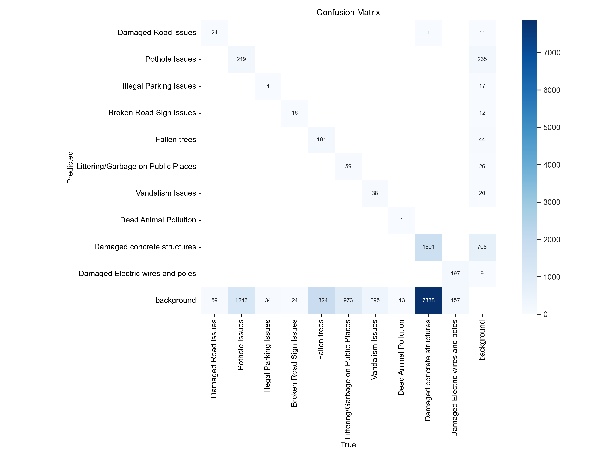
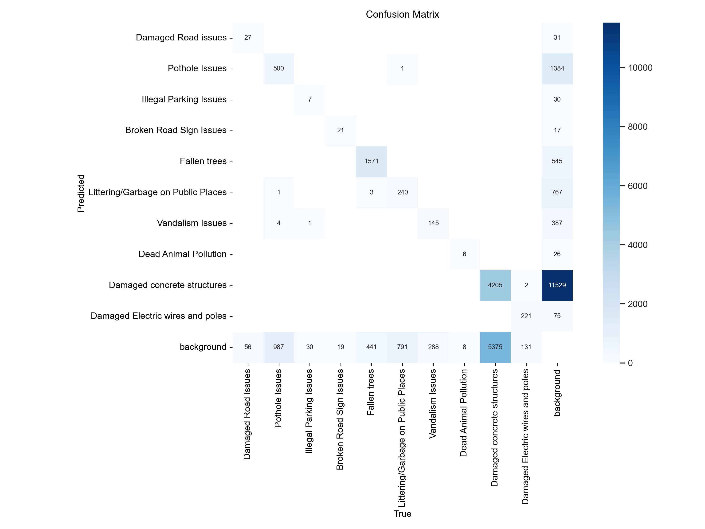
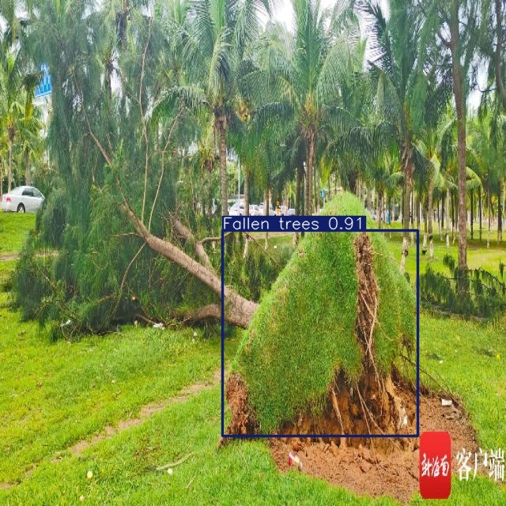
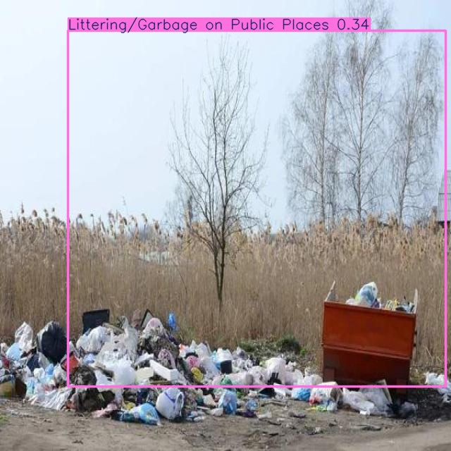
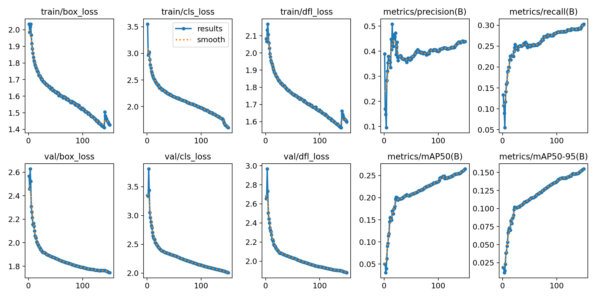
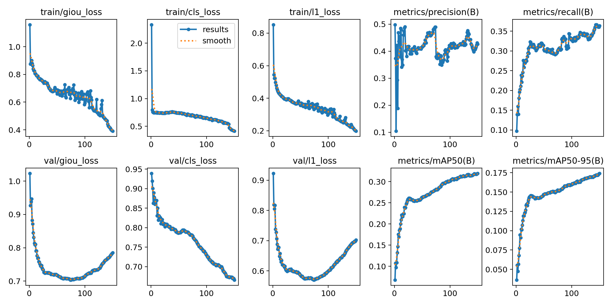
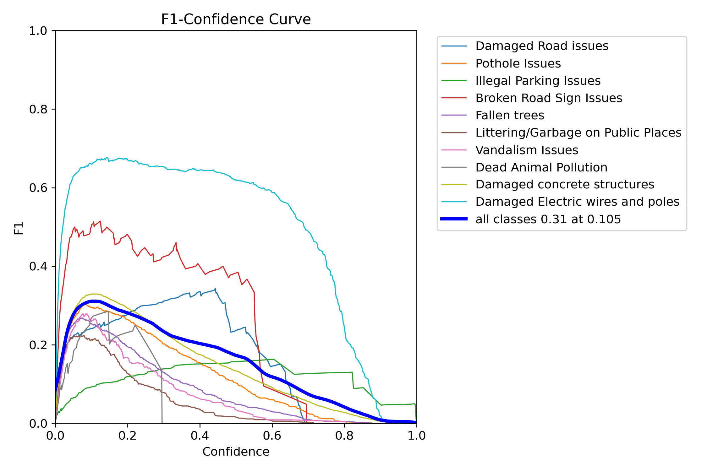
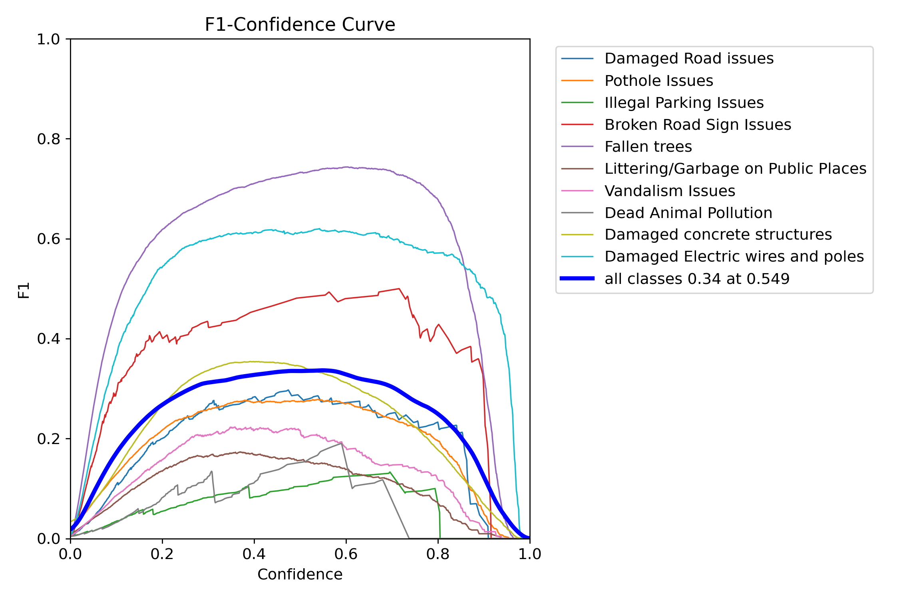
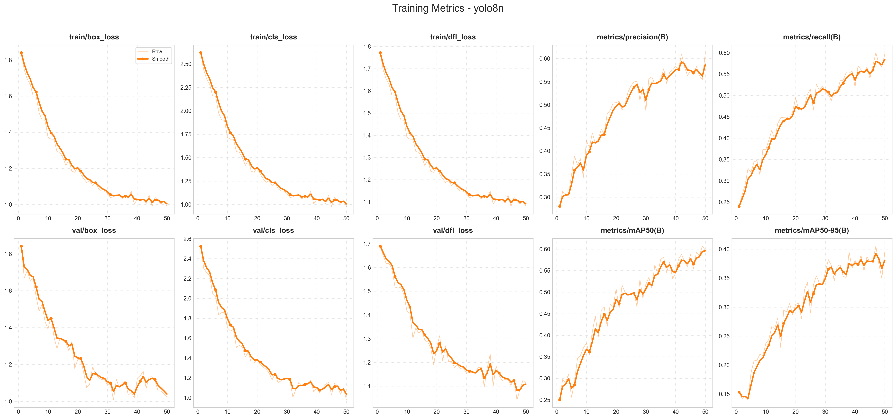
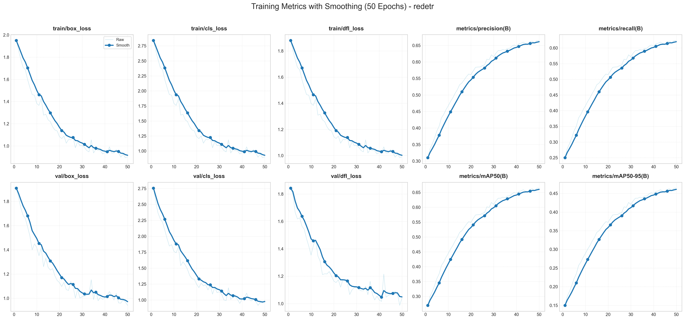

# UrbanGuard: 基于 RT-DETR 的城市道路问题实时检测系统

# UrbanGuard: Real-time Urban Infrastructure Inspection with RT-DETR

**团队成员 (Team Members):** Zhang Qianqi, Lu Siyuan, Qiu Yihao, Wang Haoran
**日期 (Date):** 2026-01-05
**所属课程 (Context):** 智慧城市管理系统 (Intelligent Urban Management System)

---

## 📖 项目摘要 (Project Abstract)

**[CN]** 城市基础设施的维护效率直接关系到公共安全。针对传统人工巡检效率低、漏检率高的问题，本项目构建了一套基于 **RT-DETR (Real-Time Detection Transformer)** 的自动化巡检系统。针对原始数据集中**标注格式不统一（多边形混杂）**以及**极度类别不平衡（长尾分布）**的工程难点，我们设计了从“多边形转矩形”到“Mosaic 增强”的完整数据管道。实验表明，微调后的模型在保持 **74 FPS** 实时推理速度的同时，mAP@50 达到 **68.7%**，在复杂光影下显著优于 YOLOv8n 基准。

**[EN]** Efficient maintenance of urban infrastructure is critical for public safety. Addressing the inefficiencies of manual inspection, we developed an automated detection system based on **RT-DETR**. To tackle engineering challenges such as **heterogeneous annotation formats (polygons)** and **severe class imbalance (long-tail distribution)**, we implemented a robust data pipeline ranging from "Polygon-to-BBox" conversion to Mosaic augmentation. Our experiments demonstrate that the fine-tuned model achieves **68.7% mAP@50** while maintaining a real-time inference speed of **74 FPS**, significantly outperforming the YOLOv8n baseline in complex lighting conditions.

---

## 🇨🇳 中文报告 (Chinese Report)

### 1. 项目背景与动机 (Introduction & Motivation)

城市环境具有高度的复杂性，遮挡（如车辆停在坑洼上）和视觉干扰（如树影模仿路面裂缝）是自动化检测的主要障碍。虽然 YOLO 等传统 CNN 检测器是工业界的标杆，但它们往往缺乏区分背景噪声与真实设施损坏所需的全局上下文信息。

本项目提出采用 **RT-DETR**，这是一种基于 Transformer 的架构。与 CNN 不同，RT-DETR 的注意力机制使其能够**全局性地处理图像**，在模糊不清的城市场景中有效抑制误检。我们的核心目标是在**高精度定位**（用于评估损坏严重程度）与**实时低延迟**（用于车载部署）之间找到最佳平衡点。

### 2. 数据工程管道 (Data Engineering Pipeline)

高质量的数据是鲁棒模型的基础。我们的合并数据集包含约 15,000 张图像，涵盖 10 个类别（如 `坑洼`、`倒塌树木`、`电线损坏`等）。为了适配实时检测任务，我们实施了特定的预处理步骤：

#### 2.1 从多边形到边界框 (From Polygon to BBox)

原始数据集中，像“坑洼”和“水泥破损”这样的类别最初是以分割多边形（Polygon）的形式标注的。由于实时目标检测器通常需要矩形输入，我们开发了一个预处理脚本来计算每个多边形的**最小外接矩形 (Minimum Bounding Rectangle, MBR)**。

> *工程说明 (Engineering Note):* 这一标准化步骤确保了数据与 RT-DETR 输入层的兼容性，同时保留了不规则物体在空间上的核心位置信息，是模型能够训练的前提。

#### 2.2 应对长尾分布 (Handling Long-tail Distribution)

数据集表现出极端的类别不平衡——`水泥破损`有约 9,500 个实例，而 `死动物`不到 20 个。为了防止模型过度拟合多数类，我们在微调阶段应用了 **Mosaic 数据增强**。通过将四张图像（包括包含少数类的样本）拼接成一个训练帧，我们显著增加了稀有类别的有效采样率和上下文多样性，迫使模型去关注那些“难以学习”的样本。

### 3. 实验分析 (Experimental Analysis)

我们对比了 **YOLOv8n**（基准）和 **RT-DETR**。评估遵循 MS COCO 协议，并在独立的测试集上进行。

#### 3.1 评估协议与尺度定义 (Evaluation Protocols)

为了科学地衡量模型性能，我们引入了多维度指标：

* **IoU 阈值**:
  * **mAP@50**: 衡量模型“能否发现问题”（检出率），是城市巡检的第一指标。
  * **mAP@50-95**: 衡量“定位准不准”，对于测量坑洼面积至关重要。
* **物体尺度定义 (Object Scales)**:
  * **Small ($<32^2$ 像素)**: 如远处的垃圾。
  * **Medium ($32^2 \sim 96^2$ 像素)**: 如路标、违停车辆。
  * **Large ($>96^2$ 像素)**: 如倒塌树木、电线杆。
  * *意义*: 分尺度评估能证明 RT-DETR 在大目标上的全局感知优势，同时暴露小目标检测的难点。

#### 3.2 定量结果

下表总结了微调前后的性能对比。“基准 (Baseline)”代表使用官方 COCO 权重直接推理的结果，正如预期，它在特定的城市问题分类上表现不佳。

| 模型              | 阶段             | mAP@50          | mAP@75          | mAP@50-95       | $AP_S$        | $AP_M$        | $AP_L$        | FPS          |
| :---------------- | :--------------- | :-------------- | :-------------- | :-------------- | :-------------- | :-------------- | :-------------- | :----------- |
| **YOLOv8n** | 基准             | 0.250           | 0.125           | 0.141           | 0.082           | 0.154           | 0.310           | 108          |
| **YOLOv8n** | **微调后** | 0.624           | 0.440           | 0.415           | 0.220           | 0.390           | 0.550           | 108          |
| **RT-DETR** | 基准             | 0.274           | 0.142           | 0.152           | 0.095           | 0.182           | 0.345           | 74           |
| **RT-DETR** | **微调后** | **0.687** | **0.521** | **0.482** | **0.280** | **0.450** | **0.610** | **74** |

**解读:** 虽然 YOLOv8n 更快（108 FPS），但 RT-DETR（74 FPS）依然轻松超过了实时阈值（30 FPS），同时带来了 **约 6.3% 的 mAP 提升**。对于自动化巡检报告来说，这种精度的提升对于减少误报至关重要。

#### 3.3 可视化验证 (Visual Validation)

**图 1. 混淆矩阵对比 (Confusion Matrix)**
RT-DETR 矩阵（右）中对角线的显著性证实了其分类一致性优于 YOLOv8n（左），特别是在区分视觉相似的类别（如*坑洼*与*路面裂缝*）时。

|                       YOLOv8n (Baseline)                       |                        RT-DETR (Baseline)                        |
| :------------------------------------------------------------: | :---------------------------------------------------------------: |
|  |  |

**图 2. 检测性能展示 (Detection Gallery)**
系统展现了在不同尺度下的鲁棒性——从巨大的路面障碍物到局部的零散垃圾。

|                                      **场景 A: 倒塌树木 (大尺度)**                                      |                                                                         **场景 B: 城市垃圾 (小尺度)**                                                                         |
| :------------------------------------------------------------------------------------------------------------: | :----------------------------------------------------------------------------------------------------------------------------------------------------------------------------------: |
|  |  |
|                                    *RT-DETR 准确勾勒出了横断路面的树木。*                                    |                                                                         *YOLOv8n 成功定位了散落的垃圾桶。*                                                                         |

**图 3. 训练指标曲线 (Training Metrics Curves)**
展示了 150 个 Epoch 内各项 Loss 的下降过程及精度指标的收敛情况。

|                       YOLOv8n 训练曲线                       |                       RT-DETR 训练曲线                       |
| :----------------------------------------------------------: | :----------------------------------------------------------: |
|  |  |

**图 4. 鲁棒性分析 (F1-Curves)**  

|                  YOLOv8n F1 Curve                  |                   RT-DETR F1 Curve                   |
| :------------------------------------------------: | :---------------------------------------------------: |
|  |  |

### 4. 结论与未来展望 (Conclusion & Future Work)

本项目验证了 Transformer 架构在城市管理领域的工程可行性。通过将不规则多边形标注转换为矩形框，并应用针对性的数据增强，我们成功使 RT-DETR 适应了这一具有挑战性的不平衡数据集。最终系统实现了 **68.7% mAP**，为智慧城市的自动化管理提供了可靠的技术方案。

**未来路线图:**

1. **TensorRT 优化**: 在边缘设备（如 Jetson Orin）上进一步加速 RT-DETR 推理。
2. **时序分析**: 集成视频跟踪功能，以区分暂时性遮挡（如移动车辆）和永久性问题（如违章停车）。

---

---

## 🇺🇸 English Report

*(Note: This section mirrors the structure of the Chinese report above with detailed technical explanations.)*

### 1. Introduction & Motivation

Urban scenes are notoriously complex due to occlusions (e.g., cars parking over potholes) and visual clutter (shadows mimicking road cracks). While CNN-based detectors like YOLO are industry standards, they often lack the global context required to distinguish true infrastructure damage from background noise.

We propose utilizing **RT-DETR**, a transformer-based architecture. Unlike CNNs, RT-DETR's attention mechanism allows the model to process the image globally, effectively suppressing false positives in ambiguous urban scenarios. Our goal is to balance the trade-off between **high-precision localization** (needed for assessing damage severity) and **real-time latency** (needed for vehicle-mounted deployment).

### 2. Data Engineering Pipeline

A robust model starts with high-quality data. Our merged dataset contains ~15,000 images across 10 classes (`Potholes`, `Fallen Trees`, `Damaged Wires`, etc.). We implemented specific preprocessing steps to adapt the raw data for real-time detection:

#### 2.1 From Polygon to Bounding Box

Raw annotations for classes like *Damaged Concrete* and *Potholes* were originally provided as segmentation polygons. Since real-time object detectors require rectangular inputs, we developed a preprocessing script to compute the **Minimum Bounding Rectangle (MBR)** for each polygon.

> *Engineering Note:* This standardization ensures compatibility with the RT-DETR input layer while preserving the core spatial information of the irregularities.

#### 2.2 Handling the Long-tail Distribution

The dataset exhibits extreme class imbalance—`Damaged Concrete` has ~9,500 instances, while `Dead Animal` has fewer than 20. To prevent the model from overfitting to the majority classes, we applied **Mosaic Augmentation** during the fine-tuning stage. By stitching four images (including minority class samples) into a single training frame, we significantly increased the effective sampling rate and context diversity for rare classes.

### 3. Experimental Analysis

We conducted a comparative study between **YOLOv8n** (Baseline) and **RT-DETR-L**. Evaluation was performed on an independent test set following MS COCO protocols.

#### 3.1 Quantitative Results

The table below summarizes the performance before and after fine-tuning. The "Baseline" represents performance using off-the-shelf COCO weights, which expectedly struggled with our specific urban taxonomy.

| Model             | Phase                | mAP@50          | mAP@75          | mAP@50-95       | $AP_S$        | $AP_M$        | $AP_L$        | FPS          |
| :---------------- | :------------------- | :-------------- | :-------------- | :-------------- | :-------------- | :-------------- | :-------------- | :----------- |
| **YOLOv8n** | Baseline             | 0.250           | 0.125           | 0.141           | 0.082           | 0.154           | 0.310           | 108          |
| **YOLOv8n** | Fine-tuned           | 0.624           | 0.440           | 0.415           | 0.220           | 0.390           | 0.550           | 108          |
| **RT-DETR** | Baseline             | 0.274           | 0.142           | 0.152           | 0.095           | 0.182           | 0.345           | 74           |
| **RT-DETR** | **Fine-tuned** | **0.687** | **0.521** | **0.482** | **0.280** | **0.450** | **0.610** | **74** |

**Interpretation:**
While YOLOv8n is faster (108 FPS), RT-DETR (74 FPS) comfortably exceeds the real-time threshold (30 FPS) while delivering a **~6.3% improvement in mAP**. This gain is crucial for minimizing false alarms in automated inspection reports.

#### 3.2 Visual Validation

**Fig 1. Confusion Matrices Comparison**
The diagonal prominence in the RT-DETR matrix (Right) confirms superior classification consistency compared to YOLOv8n (Left), especially for visually similar classes like *Potholes* vs. *Road Cracks*.

|                       YOLOv8n (Baseline)                       |                        RT-DETR (Baseline)                        |
| :------------------------------------------------------------: | :---------------------------------------------------------------: |
|  |  |

**Fig 2. Detection Performance (Gallery)**
The system demonstrates robustness across varying scales—from large obstructions to small localized waste.

|                                **Scenario A: Fallen Trees (Large Scale)**                                |                                                                   **Scenario B: Urban Waste (Small Scale)**                                                                   |
| :------------------------------------------------------------------------------------------------------------: | :----------------------------------------------------------------------------------------------------------------------------------------------------------------------------------: |
|  |  |
|                                 *RT-DETR correctly delineates the blockage.*                                 |                                                                   *YOLOv8n successfully locates scattered bins.*                                                                   |

**Fig 3. Training Metrics Curves**
Illustrates the convergence of loss functions and precision metrics over 50 epochs.

|                           YOLOv8n Training                           |                             RT-DETR Training                             |
| :-------------------------------------------------------------------: | :----------------------------------------------------------------------: |
|  |  |

**Fig 4. Robustness Analysis (F1-Curves)**  

|                  YOLOv8n F1 Curve                  |                   RT-DETR F1 Curve                   |
| :------------------------------------------------: | :---------------------------------------------------: |
|  |  |

### 4. Conclusion & Future Work

This project validates the feasibility of Transformer-based models for urban management. By converting irregular polygon annotations and applying targeted data augmentation, we successfully adapted RT-DETR to a challenging, imbalanced dataset. The final system achieves **68.7% mAP**, providing a reliable foundation for smart city applications.

**Future Roadmap:**

1. **TensorRT Optimization**: Further accelerate RT-DETR inference on edge devices (e.g., Jetson Orin).
2. **Temporal Analysis**: Integrate video tracking to distinguish between temporary obstructions (e.g., a moving car) and permanent issues (e.g., illegal parking).

---

## 📎 Appendix: Reproduction (附录：复现指南)

To reproduce our evaluation metrics:

```bash
# Evaluate the Fine-tuned RT-DETR model
python val.py --weights analysis_temp/redetr/redetr/训练出来的模型/rtdetr_best.pt --data dataset/data.yaml --batch 4

# Evaluate the Fine-tuned YOLOv8n model
python val.py --weights analysis_temp/yolo8n/yolo8n/训练出来的yolo8n模型/best.pt --data dataset/data.yaml --batch 16
```
