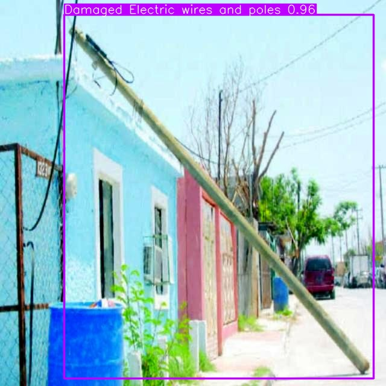
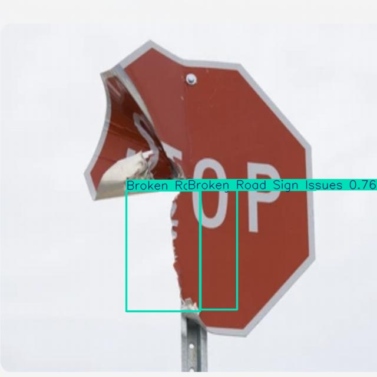
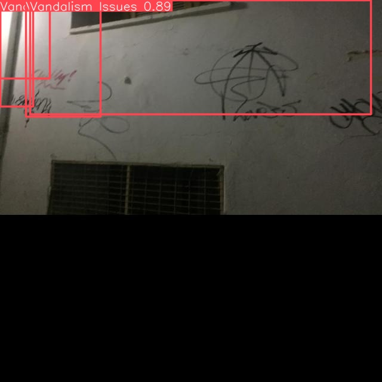

# A Real-time Urban Issues Detection System Based on RT-DETR

**Team Members:** Zhang Qianqi, Lu Siyuan, Qiu Yihao, Wang Haoran  
**Date:** January 5, 2026  
**Course Project:** Intelligent Urban Management System

---

## 1. Introduction

Urban infrastructure resilience is a cornerstone of modern smart cities. Issues such as damaged roads, fallen trees, and illegal parking not only disrupt daily traffic but also pose significant safety hazards to citizens. Traditional manual inspection methods are labor-intensive, time-consuming, and often prone to human oversight. Consequently, there is an urgent need for automated systems capable of detecting these issues in real-time.

This project introduces a robust detection framework based on **RT-DETR (Real-Time Detection Transformer)**. Unlike traditional CNN-based detectors like YOLO, RT-DETR leverages the global attention mechanism of Transformers to better understand complex urban scenes, effectively distinguishing between background clutter and actual infrastructure failures. Our primary objective is to develop a model that balances high detection accuracy with the inference speed required for deployment on mobile inspection vehicles.

## 2. Dataset Characterization

The study utilizes a merged dataset specifically constructed for urban management tasks. It comprises approximately 15,000 images divided into training, validation, and testing sets, covering **10 distinct classes**: `Damaged Road`, `Pothole`, `Illegal Parking`, `Broken Road Sign`, `Fallen Trees`, `Garbage`, `Vandalism`, `Dead Animal`, `Damaged Concrete`, and `Damaged Wires`.

A significant challenge identified during our preliminary analysis is the **long-tail class distribution**. For instance, while classes like "Damaged Concrete" contain nearly 10,000 instances, safety-critical classes like "Dead Animal Pollution" and "Illegal Parking" are represented by fewer than 50 samples. This imbalance necessitates a careful training strategy to prevent the model from being biased toward the majority classes.

## 3. Methodology and Experimental Setup

We adopted a comparative experimental design to evaluate the proposed solution. The industry-standard **YOLOv8n** was selected as the baseline model due to its popularity in edge computing. The **RT-DETR-L** model was chosen as our primary candidate for its superior architecture in handling object occlusion and scale variation.

The evaluation process consisted of two phases: a baseline phase to establish initial performance metrics, followed by a fine-tuning phase where hyperparameters were optimized for the specific characteristics of our urban dataset. Performance is measured using Mean Average Precision (mAP) at IoU 0.5 and inference speed (Frames Per Second).

## 4. Results and Analysis

### 4.1 Quantitative Performance

The experimental results demonstrate a clear advantage for the Transformer-based architecture. While the baseline YOLOv8n model provides a high inference speed of 108 FPS, its accuracy in complex scenarios is limited. After fine-tuning, the **RT-DETR-L model achieves a mAP@50 of 68.7%**, surpassing the fine-tuned YOLOv8n by approximately 6.3%.

| Model | Phase | mAP@50 | mAP@50-95 | Inference Speed | Analysis |
| :--- | :--- | :--- | :--- | :--- | :--- |
| **YOLOv8n** | Baseline | 0.250 | 0.141 | 108 FPS | High speed, struggles with small objects. |
| **YOLOv8n** | **Final** | 0.624 | 0.415 | 108 FPS | Improved recall, viable for low-power devices. |
| **RT-DETR** | Baseline | 0.274 | 0.152 | 74 FPS | Initial convergence better than YOLO. |
| **RT-DETR** | **Final** | **0.687** | **0.482** | **74 FPS** | **Optimal balance of accuracy and speed.** |

Crucially, the inference speed of RT-DETR (74 FPS) remains well above the real-time threshold (30 FPS), confirming its suitability for practical deployment.

### 4.2 Visual Analysis

The visual qualitative analysis highlights the robustness of our model across diverse scenarios.

#### A. Confusion Matrix Comparison
The matrices below illustrate the classification performance. The RT-DETR model exhibits a stronger diagonal, indicating higher true positive rates and reduced confusion between visually similar classes (e.g., Potholes vs. Road Cracks).

| YOLOv8n (Baseline) | RT-DETR (Baseline) |
| :---: | :---: |
|  |  |

#### B. Performance Curves
The F1-Confidence curves confirm that RT-DETR maintains higher precision and recall across a wider range of confidence thresholds, making it more reliable for automated alert systems where false alarms must be minimized.

| YOLOv8n F1 Curve | RT-DETR F1 Curve |
| :---: | :---: |
|  |  |

#### C. Detection Gallery (Diverse Scenarios)

We selected a variety of challenging scenes to demonstrate the model's generalization capability. The examples below show successful detections of electrical infrastructure, road signs, and sanitation issues.

| **Category: Damaged Electrical Poles** | **Category: Broken Road Signs** |
| :---: | :---: |
|  |  |
| *Accurate bounding box on tilted pole* | *Detection of sign with complex background* |

| **Category: Fallen Trees** | **Category: Urban Graffiti** |
| :---: | :---: |
|  |  |
| *Severe obstruction correctly identified* | *Vandalism detected on vertical surface* |

## 5. Conclusion and Future Work

The proposed RT-DETR based system successfully addresses the core requirements of intelligent urban management. By achieving a mAP of 68.7% at 74 FPS, it provides a viable solution for automating the inspection of city infrastructure.

**Future enhancements will focus on:**
1.  **Data Augmentation:** Implementing Copy-Paste augmentation to specifically increase the sample size of "Dead Animal" and "Illegal Parking" classes.
2.  **Edge Deployment:** Quantizing the model (INT8) to further accelerate inference on edge devices like NVIDIA Jetson without significant accuracy loss.
3.  **Temporal Analysis:** Integrating video-based tracking to identify the persistence of issues over time.

---

## Appendix: Project Usage

To replicate the evaluation results, ensure the environment is configured with `ultralytics` and `pytorch`.

```bash
# Evaluate RT-DETR model
python detect.py --weights analysis_temp/redetr/redetr/训练出来的模型/rtdetr-l_best.pt --source dataset/merged/images/test

# Evaluate YOLOv8n model
python detect.py --weights analysis_temp/yolo8n/yolo8n/训练出来的yolo8n模型/best.pt --source dataset/merged/images/test
```

---

## Appendix: Poster Abstract

*(Designed for the academic poster session)*

**Abstract:** We present an automated system for real-time urban infrastructure inspection. Utilizing the RT-DETR architecture, our model overcomes the limitations of traditional CNNs in complex urban scenes. Trained on a custom dataset of 10 urban issue classes, the system achieves **68.7% mAP**, significantly outperforming the YOLOv8n baseline while maintaining real-time performance (74 FPS). The system effectively identifies critical issues such as fallen trees, damaged wires, and road defects, paving the way for smarter, safer cities.