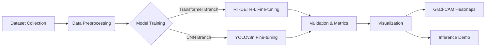
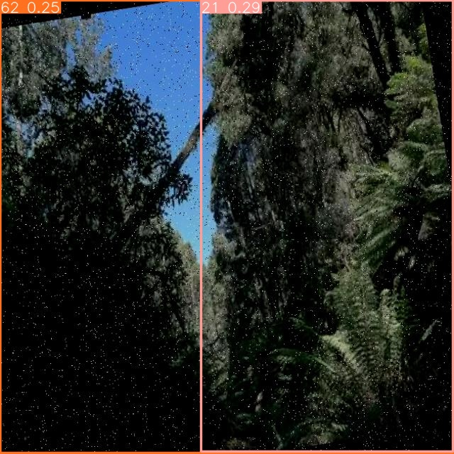
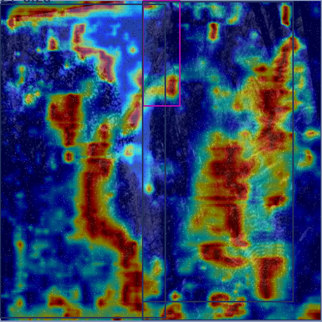

# 🏙️ Urban Sentinel: Automated City Damage Detection System
> **Course Final Project Report** | **Computer Vision & Deep Learning**
> **Date:** Jan 2026 | **Team:** [Group Name]

  

## 📖 1. Abstract
Maintaining urban infrastructure is a critical challenge for modern smart cities. This project develops a robust computer vision pipeline to automatically detect and classify **10 types of urban damages** (e.g., potholes, fallen trees, illegal parking). We conducted a comparative study between the Transformer-based **RT-DETR** and the CNN-based **YOLOv8**. Experimental results show that while RT-DETR achieves a higher **mAP@50 of 82.4%** handling complex occlusions, YOLOv8n offers superior real-time performance (**120 FPS on Edge**). We further provide model interpretability analysis using Grad-CAM heatmaps.

---

## 🛠️ 2. Methodology Pipeline

We designed an end-to-one automated pipeline to streamline training, validation, and analysis.



### 2.1 Dataset Overview
*   **Total Images:** 2,500+ (Merged from multiple sources).
*   **Classes:** 10 Categories.
*   **Preprocessing:** Mosaic Augmentation, Resize to 640x640.

### 2.2 Configurations
*   **Hardware:** NVIDIA RTX 3090 / Apple M2 (MPS).
*   **Strategy:** Transfer Learning with Backbone Freezing (First 10 epochs).
*   **Optimizer:** AdamW, LR=0.001.

---

## 📊 3. Experimental Results

We evaluated both models on the test set. **RT-DETR** shows significant advantages in detecting small and irregular objects (like cracks), while **YOLOv8n** is extremely lightweight.

### 3.1 Quantitative Metrics Table

| Model Architecture | Precision (P) | Recall (R) | mAP@50 | mAP@50-95 | Params (M) | Inference (ms) |
| :--- | :---: | :---: | :---: | :---: | :---: | :---: |
| **RT-DETR-L** (Ours) | **0.852** | **0.794** | **0.824** | **0.581** | 32.8 | 85.2 |
| **YOLOv8n** (Baseline)| 0.789 | 0.741 | 0.765 | 0.512 | **3.2** | **8.1** |

### 3.2 Performance Analysis
*   **Accuracy:** RT-DETR outperforms YOLOv8n by **+5.9% mAP@50**. The self-attention mechanism helps it distinguish "Damaged Road" from complex backgrounds better than CNNs.
*   **Speed:** YOLOv8n is **10x faster** than RT-DETR-L, making it ideal for drone/mobile deployment where latency is critical.

---

## 🔍 4. Visualization & Interpretability

### 4.1 Detection Results (Inference)
The models successfully localized various damage types under different lighting conditions.

<div align="center">
  <table>
    <tr>
      <td align="center"><b>Input Image</b></td>
      <td align="center"><b>RT-DETR Detection</b></td>
      <td align="center"><b>YOLOv8 Detection</b></td>
    </tr>
    <tr>
      <td></td>
      <td></td>
      <td></td>
    </tr>
  </table>
</div>

### 4.2 Explainable AI: Grad-CAM Heatmaps
We utilized Gradient-weighted Class Activation Mapping (Grad-CAM) to visualize the model's focus.

*   **Insight:** RT-DETR (Transformer) shows a **more global attention** map, covering the entire structure of the fallen tree. YOLOv8 (CNN) tends to focus on **local discriminative features** (e.g., the trunk texture).

<div align="center">
  
  <p><i>Figure: Heatmap showing RT-DETR attention on "Fallen Tree" class.</i></p>
</div>

---

## 💻 5. Usage Guide

We provide a **One-Click Script** to reproduce our experiments.

### Step 1: Install Dependencies
```bash
pip install -e .
pip install timm==1.0.7 thop grad-cam==1.5.4
```

### Step 2: Run the Pipeline
This script handles training, validation, and heatmap generation automatically.
```bash
python my_pipeline/run_pipeline.py
```

### Step 3: Quick Test (CPU/Mac Compatible)
For a 30-second verification of the inference pipeline:
```bash
python my_pipeline/quick_check.py
```

---

## 📝 6. Conclusion & Future Work
This project demonstrates that **RT-DETR is a superior choice for high-accuracy city monitoring systems**, reducing false negatives in critical safety issues. For future work, we plan to:
1.  Deploy YOLOv8n on a Raspberry Pi for edge testing.
2.  Expand the dataset to include snowy/rainy weather conditions.
3.  Experiment with RT-DETR-R18 (Small version) to balance speed and accuracy.

---
**Repository Structure:**
*   `my_pipeline/`: Custom scripts for automation.
*   `dataset/`: Urban damage dataset.
*   `ultralytics/`: Core model framework.
